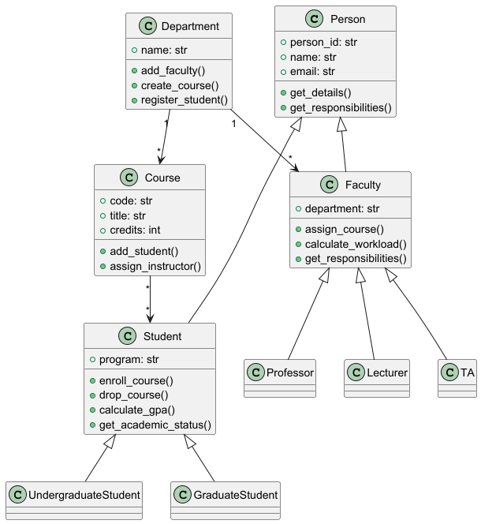
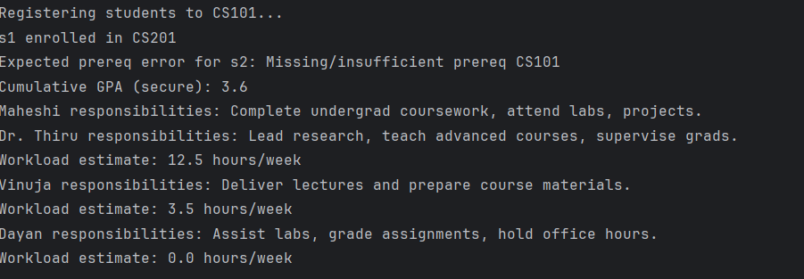

# Question 1 – University Management System

## Project Overview:
The project involves a university management system that is programmed in Python and Object-Oriented Programming(OOP). It handles various departments, courses, students and faculty which reflects the OOP concepts such as inheritance, encapsulation, and Polymorphism.

### Repository Structure: 
```bash
├──question1_university_system/  
│ ├── main.py            #Program entry point demonstrating system features  
│ ├── person.py          #Base person class  
│ ├── student.py         #Student class and subclasses  
│ ├── faculty.py         #Defines Faculty, Professor, Lecturer, and TA classes, also extending Person.   
│ ├── department.py      #Showing a Department, which manages students, faculty, and courses. 
```
## How to run:
1. Make sure to install python 3.
2. Clone the repository
3. Navigate to the question 1 directory (question1_university_system)
4. Run the main script (bash - python main.py)

This executes this system demo that forms departments, faculty, and students, registers courses, computes GPA, and displays tasks.

## UML Diagram



## Example Output (from main.py)


# Question 2 – University Management System

## Project Overview:
This is focusing on multi-source e-commerce data analysis. The goal is to scrape, clean, analyze, and visualize data from different sources to understand patterns in ratings, pricing and product availability.

### Data sources used:

**books.toscrape.com** → Product details, price, ratings, stock  
**Demo e-commerce site** → Product details, prices, descriptions  
**RSS Feeds** → Structured XML feed data

The project also includes predictive analysis with linear regression and a basic recommendation system.

## Repository Structure:

```bash
question2_social_media_analysis/
│── data_collection/
│   ├── scrape_books.py         # Scraper for books.toscrape.com
│   ├── scrape_demo.py          # Scraper for demo e-commerce site
│   ├── rss_parser.py           # RSS feed parser
│   └── (CSV files saved here)
│
│── data_processing/
│   ├── clean_books.py          # Data cleaning pipeline (all sources)
│   └── (Cleaned CSV files saved here)
│
│── analysis/
│   ├── stats_analysis.py       # Statistical analysis and summaries
│
│── visualizations/
│   ├── visualize_books.py      # Plots & interactive visualizations
│
│── main.py                     # Main execution script (end-to-end workflow)
│── README.md                   # Project documentation
```

## How to Run

1.**Clone the repository (or open it in PyCharm):**  
2.**Install dependencies:** 
```bash
pip install -r requirements.txt
```
(or manually install: requests, beautifulsoup4, pandas, matplotlib, seaborn, plotly, scikit-learn, feedparser)  
3.**Run the main workflow:**
```bash
python main.py
```
4.**Outputs generated:**  
• Raw scraped CSVs → data_collection/  
• Cleaned CSVs → data_processing/  
• Visualizations (.png and interactive .html) → respective folders  
• Console → Statistical analysis, regression results, recommendations  

## File Descriptions

#### main.py 
Runs the full project pipeline: scraping → cleaning → analysis → visualization → predictive modeling.
#### scrape_books.py
Scrapes product data from books.toscrape.com (multi-page, price, rating, availability).
#### scrape_demo.py
Scrapes demo e-commerce site products (title, price, description).
#### rss_parser.py
Parses RSS feeds into structured CSV (title, summary, published date).
#### data_processing/clean_books.py
Unified cleaning pipeline for handling duplicates, missing values, text normalization, and date standardization.
#### analysis/stats_analysis.py
Statistical analysis: descriptive statistics, outlier detection, correlation analysis.
#### visualizations/visualize_books.py
Creates histograms, boxplots, scatterplots, bar charts, and interactive visualizations.

## Design and Implementation Notes

#### Error Handling & Delays:
• Scrapers use requests with error handling and delays to avoid overloading servers.
• Pagination implemented for books.toscrape.com.
#### Multi-source Integration:
• Supports structured (RSS/XML), semi-structured (HTML), and tabular (CSV/JSON) data sources.
• Unified cleaning function standardizes across datasets.
#### Data Cleaning:
• Removes duplicates, missing values, and non-numeric prices.
• Converts ratings (One–Five) → numeric scale (1–5).
• Standardizes dates across feeds.
#### Analysis:
• Provides descriptive statistics, outlier detection (IQR method), and correlation analysis.
• Compares price distributions and category trends.
#### Visualization:
• Static plots with Matplotlib/Seaborn.
• Interactive plots with Plotly for deeper exploration.
#### Predictive Analysis:
• Linear regression to predict book prices based on ratings.
• Basic recommendation system based on rating similarity.
